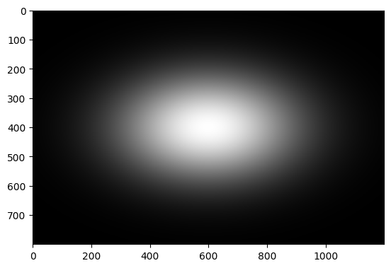
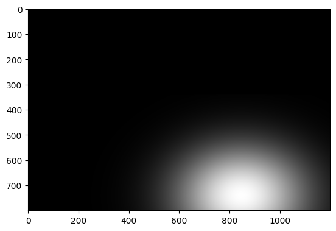

# Propose
A general propose and scalabe dataset creator, with the propose of train AI to IQA methods

# Functions

## <grey>Blurs</grey>

### <grey>Gaussian blur</grey>
~~~ python
0: generate_gaussian_blur(image, sigma, kernel_size)
~~~
#### Parâmetros:
- **image** (*numpy.ndarray*): Imagem de entrada em formato NumPy, com 3 canais de cor (BGR).
- **sigma** (*float*): Desvio padrão da distribuição Gaussiana.
- **kernel_size** (*int*): Tamanho do kernel quadrado aplicado ao filtro Gaussiano (deve ser ímpar).

#### Retorno:
- **numpy.ndarray**: Imagem com o efeito de desfoque Gaussiano aplicado.

#### Funcionamento:
1. Um kernel Gaussiano de tamanho `kernel_size x kernel_size` é gerado.
2. A função `cv.GaussianBlur` é aplicada à imagem usando o desvio padrão `sigma`.
3. O resultado é uma imagem suavizada, reduzindo ruídos e detalhes pequenos.
---

### <grey>Motion blur</grey>
~~~python
1: generate_motion_blur(image, kernel_size)
~~~
#### Parâmetros:
- **image** (*numpy.ndarray*): Imagem de entrada em formato NumPy, com 3 canais de cor (BGR).
- **kernel_size** (*int*): Tamanho do kernel usado para simular o desfoque de movimento (deve ser ímpar).

#### Retorno:
- **tupla[numpy.ndarray, numpy.ndarray, numpy.ndarray]**: Três imagens com desfoque de movimento aplicado nas direções **horizontal**, **vertical** e **diagonal**.

#### Funcionamento:
1. Três kernels diferentes são criados para aplicar o efeito de desfoque de movimento:
   - **Horizontal**: Cria um kernel com valores diferentes na linha central.
   - **Vertical**: Cria um kernel com valores diferentes na coluna central.
   - **Diagonal**: Cria um kernel com valores ao longo da diagonal.
2. Cada kernel é convolvido com a imagem original usando `cv.filter2D`, resultando em três versões desfocadas.
3. As imagens resultantes representam o efeito de desfoque em diferentes direções.

## <red>Noises</red>

### <red> Gaussian noise </red>

~~~python
2: generate_gaussian_noise(image, mean, variance)
~~~

#### Parâmetros:
 **image** (*numpy.ndarray*): Imagem de entrada em formato NumPy, com um ou três canais.
- **mean** (*float*): média da distribuição gaussiana
- **variance** (*float*): A variância da distribuição gaussiana 

#### Retorno:
- **numpy.ndarray**: Imagem com ruído gaussiano adicionado.

#### Funcionamento:
1. Analisa se a imagem possui apenas um canal (escala de cinza) ou três canais
2. Usa a função `random.normal` para gerar uma nova matriz com mesmo tamanho da imagem original a partir de amostras de uma distribuição gaussiana com variância `variance`e média `mean`
3. Retorna a soma das imagens originais com a matriz de valores da distribuição gaussiana, gerando ruído na imagem.

### <red>Uniform noise</red>

~~~python
3: generate_uniform_noise(image, limit)
~~~

#### Parâmetros:
 **image** (*numpy.ndarray*): Imagem de entrada em formato NumPy, com um ou três canais.
- **limit** (*int*): limite máximo dos valores que serão adicioandos à imagem original

#### Retorno:
- **numpy.ndarray**: Imagem com ruído uniforme adicionado.

#### Funcionamento:
1. Usa a função `random.randint` para gerar uma nova matriz com mesmo tamanho da imagem original a partir de números aleatórios entre 0 e `limit`*
2. Retorna a soma a imagem original com a matriz de valores aleatŕoios
3. A imagem retornada possui uma quantidade maior de ruídos brancos 

**Obs*: Como a intenção é gerar ruído branco (white noise), essa função não gera valores menores que 0

### <red>Speckle noise</red>
~~~python
4: generate_speckle_noise(image)
~~~
--- 

#### Parâmetros:
 **image** (*numpy.ndarray*): Imagem de entrada em formato NumPy, com um ou três canais.
- **mean** (*float*): média da distribuição gaussiana
- **variance** (*float*): A variância da distribuição gaussiana 

#### Retorno:
- **numpy.ndarray**: Imagem com ruído speckle adicionado.

#### Funcionamento:
1. Analisa se a imagem possui apenas um canal (escala de cinza) ou três canais
2. Usa a função `random.normal` para gerar uma nova matriz com mesmo tamanho da imagem original a partir de amostras de uma distribuição gaussiana com variância `variance`e média `mean`
3. Realiza a soma das imagens originais com seus próprios valores multiplicados pela matriz de valores da distribuição gaussiana:
        N = I + IG, onde I é a imagem original e G é a matriz de distribuição gaussiana. 
4. A imagem retornada apresenta um ruído de caráter multiplicativo

### <red> Poisson noise </red>

~~~python
5: poisson_noise(image, bias)
~~~

#### Parâmetros:
- **image** (*numpy.ndarray*): Imagem de entrada em formato NumPy, com um ou três canais.
- **bias** (*float*): Fator de ajuste para o nível de ruído. Valores maiores aumentam a intensidade do ruído (padrão: 1).

#### Retorno:
- **numpy.ndarray**: Imagem com ruído Poisson adicionado.

#### Funcionamento:
1. Calcula o número de níveis únicos na imagem e ajusta com o fator `bias`.
2. Ajusta esse valor para a potência de dois mais próxima, para gerar uma normalização e quantização eficientes.
3. Usa a distribuição de Poisson para gerar ruído proporcional à intensidade dos pixels da imagem.
4. Normaliza os valores resultantes e os converte para valores inteiros entre 0 e 255.
5. Retorna a imagem original com o ruído Poisson aplicado.

### <red> Salt-and-Pepper noise </red>

~~~python
6: sep_noise(image, prob_white, amount)
~~~

#### Parâmetros:
- **image** (*numpy.ndarray*): Imagem de entrada em formato NumPy, com um ou três canais.
- **prob_white** (*float*): Probabilidade de os pixels corrompidos serem brancos (padrão: 0.5).
- **amount** (*float*): Proporção de pixels afetados pelo ruído em relação ao total da imagem (padrão: 0.004).

#### Retorno:
- **numpy.ndarray**: Imagem com ruído Salt-and-Pepper adicionado.

#### Funcionamento:
1. Verifica se a imagem possui um ou três canais.
3. Calcula o número de pixels que serão alterados para branco (sal) com base na probabilidade `prob_white` e no parâmetro `amount`.
4. Gera coordenadas aleatórias para aplicar o ruído branco e altera os valores dos pixels correspondentes para 255.
5. Calcula o número de pixels que serão alterados para preto (pimenta) com base na probabilidade `1-prob_white` e no parâmetro `amount` gera coordenadas aleatórias para esses pontos.
6. Gera coordenadas aleatórias para aplicar o ruído preto e altera os valores dos pixels correspondentes para 0.
7. Retorna a imagem original com o ruído Salt-and-Pepper aplicado.

## <blue>Colors</blue>

### <blue> Color Diffusion </blue>

~~~python
7: color_diffusion(img, kernel_size, sigma)
~~~

#### Parâmetros:
- **img** (*numpy.ndarray*): Imagem de entrada em formato NumPy, representada no espaço de cores BGR.
- **kernel_size** (*int*): Tamanho do kernel usado para a suavização gaussiana dos canais de cor (padrão: 99).
- **sigma** (*float*): Desvio padrão da distribuição gaussiana usada no desfoque (padrão: 0).

#### Retorno:
- **numpy.ndarray**: Imagem suavizada com difusão de cor aplicada.

#### Funcionamento:
1. Converte a imagem de BGR para RGB e de RGB para o espaço de cor CIE-Lab.
2. Separa os canais L, a e b.
3. Aplica um desfoque gaussiano aos canais a e b usando o tamanho de kernel `kernel_size` e `sigma` especificados.
4. Recombina os canais L, a e b para formar a imagem difusa no espaço Lab.
5. Converte a imagem de volta para RGB.
6. Retorna a imagem normalizada em inteiro de 0 a 255 e convertida para o espaço de cores BGR.

### <blue> Color Shift </red>

~~~python
8: color_shift(img, tx, ty)
~~~

#### Parâmetros:
- **img** (*numpy.ndarray*): Imagem de entrada em formato NumPy, representada no espaço de cores BGR.
- **tx** (*int*): Deslocamento horizontal aplicado ao canal verde normalizado pela magnitude do gradiente (padrão: 1).
- **ty** (*int*): Deslocamento vertical aplicado à canal verde normalizado pela magnitude do gradiente (padrão: 8).

#### Retorno:
- **numpy.ndarray**: Imagem com efeito de deslocamento de cor aplicado.

#### Funcionamento:
1. Converte a imagem de BGR para escala de cinza.
2. Calcula os gradientes da imagem usando operadores Sobel nas direções x e y.
3. Obtém a magnitude do gradiente e aplica um desfoque gaussiano, para que as regiões de alta frequência sejam translocadas com uma margem maior.
4. Normaliza a matriz magnitude e define uma matriz de transformação afim para deslocamento nos eixos x e y, determinado pela quantidade de pixels `tx`e `ty`.
5. Separa os canais de cor da imagem.
6. Aplica o deslocamento apenas ao canal verde.
7. Mescla os canais de cor, combinando o canal verde modificado pela magnitude com os outros canais originais.
8. Retorna a imagem resultante com o efeito de deslocamento de cor.

### <blue>Color quantization</blue>

~~~python
9: color_quantization(img, k)
~~~

#### Parâmetros:
- **img** (*numpy.ndarray*): Imagem de entrada em formato NumPy, representada no espaço de cores BGR.
- **k** (*int*): Número de cores para quantização via K-Means (padrão: 8).

#### Retorno:
- **numpy.ndarray**: Imagem quantizada com cores reduzidas.

#### Funcionamento:
1. Converte a imagem do espaço de cores BGR para LAB.
2. Aplica o algoritmo de `kmeans` do opencv para quantizar a imagem em `k` clusters de cores.
3. Converte a imagem quantizada de volta para o espaço de cores BGR.
4. Retorna a imagem com cores reduzidas de acordo com a quantização.

### <blue> Color Saturation (HSV) </blue>

~~~python
10: color_saturation_hsv(img, factor)
~~~

#### Parâmetros:
- **img** (*numpy.ndarray*): Imagem de entrada em formato NumPy, representada no espaço de cores BGR.
- **factor** (*float*): Fator de amplificação da saturação. Valores maiores que 1 aumentam a saturação, enquanto valores menores reduzem a saturação (padrão: 1.3).

#### Retorno:
- **numpy.ndarray**: Imagem com saturação ajustada.

#### Funcionamento:
1. Converte a imagem do espaço de cores BGR para HSV.
2. Separa os canais H, S e V da imagem.
3. Multiplica o canal de saturação (S) pelo fator de ajuste `factor`.
4. Garante que os valores do canal de saturação permaneçam dentro do intervalo válido (0 a 255).
5. Converte a imagem de volta para o espaço de cores BGR.
6. Retorna a imagem com a saturação modificada.

### <blue> Color Saturation (Lab) </blue>

~~~python
11: color_saturation_lab(img, factora=4, factorb=4)
~~~

#### Parâmetros:
- **img** (*numpy.ndarray*): Imagem de entrada em formato NumPy, representada no espaço de cores BGR.
- **factora** (*float*): Fator de amplificação para o canal a do espaço LAB. Valores maiores aumentam a saturação nesse canal (padrão: 4).
- **factorb** (*float*): Fator de amplificação para o canal b do espaço LAB. Valores maiores aumentam a saturação nesse canal (padrão: 4).

#### Retorno:
- **numpy.ndarray**: Imagem com saturação ajustada.

#### Funcionamento:
1. Converte a imagem do espaço de cores BGR para RGB.
2. Transforma a imagem do espaço de cores RGB para CIE-Lab.
3. Separa os canais L, a e b da imagem.
4. Multiplica os canais a e b pelos fatores especificados `factora` e `factorb`.
5. Converte a imagem processada de volta para o espaço de cores RGB.
6. Garante que os valores dos pixels no modelo RGB estão dnetro do intervalo (0 a 255)
7. Transforma a imagem RGB novamente para BGR.
8. Retorna a imagem com a saturação modificada.

## <yellow> JPEG'S compressions </yellow>

### <yellow> JPEG Compression </yellow>

~~~python
12: jpeg_compression(img, quality)
~~~

#### Parâmetros:
- **img** (*numpy.ndarray*): Imagem de entrada em formato NumPy, representada no espaço de cores BGR.
- **quality** (*int*): Qualidade da compressão JPEG (intervalo de 0 a 100, onde valores menores resultam em maior compressão e perda de qualidade, padrão: 10).

#### Retorno:
- **numpy.ndarray**: Imagem comprimida no formato JPEG e redecodificada para BGR.

#### Funcionamento:
1. Codifica a imagem para o formato JPEG com a qualidade `quality` especificada usando a função `imencode` do opencv.
2. Decodifica a imagem comprimida de volta para o formato numpy no espaço de cores BGR.
3. Retorna a imagem reconstituída após a compressão JPEG.

### <yellow>JPEG2000 compression</yellow>

~~~python
13: jpeg2000_compression(img, compression_rate)
~~~

#### Parâmetros:
- **img** (*numpy.ndarray*): Imagem de entrada em formato NumPy, representada no espaço de cores BGR.
- **compressionRate** (*int*): Taxa de compressão aplicada ao formato JPEG 2000 (valores maiores resultam em maior compressão, padrão: 50).

#### Retorno:
- **numpy.ndarray**: Imagem comprimida no formato JPEG 2000 e redecodificada para BGR.

#### Funcionamento:
1. Codifica a imagem para o formato JPEG 2000 com a taxa de compressão `compression_rate` especificada usando a função `imencode` do opencv.
2. Decodifica a imagem comprimida de volta para o formato NumPy no espaço de cores BGR.
3. Retorna a imagem reconstituída após a compressão JPEG 2000.

## <green>Warpping<green>

### <green>Invert</green>
~~~python
14 generate_invert_warp(image)
~~~

#### Parâmetros:
- **image (*numpy.ndarray*)**: Imagem de entrada a ser invertida.

#### Retorno:

- **numpy.ndarray**: Imagem com a inversão aplicada.

#### Funcionamento:
1. Definem-se os pontos iniciais e finais para a transformação da perspectiva.
2. Aplica-se a transformação de perspectiva usando `cv.getPerspectiveTransform`.
3. A imagem é invertida com a função `cv.warpPerspective` e retornada.

### <green>Shearing warp</green>

~~~python
15 generate_shearing_warp(image, sx, sy)
~~~

#### Parâmetros:
- **image** (*numpy.ndarray*): Imagem de entrada em formato NumPy, com 3 canais de cor (BGR)Imagem de entrada.
- **sx** (*float*): Valor de cisalhamento no eixo X, normalizado em ([0, 1])
- **sy** (*float*): Valor de cisalhamento no eixo Y, normalizado em ([0, 1]).

#### Retorno:
- **numpy.ndarray**: Imagem resultante do cisalhamento aplicado.

#### Funcionamento:
1. Aplica-se o cisalhamento à imagem utilizando uma matriz de transformação de cisalhamento.
2. Retorna a imagem resultante.

### <green>Elastic warp</green>

~~~python
16 generate_elastic_warp(image, alpha)
~~~

#### Parâmetros:
- **image** (*numpy.ndarray*): Imagem de entrada.
- **alpha** (*float*): Controlar a intensidade da deformação, normalizado em ([0, 1]), sendo o valor máximo de range de shift como 0.5% de `max(L, H)` sendo L largura e H altura.

#### Retorno:
- **numpy.ndarray**: Imagem deformada elasticamente.

#### Funcionamento:
1. Dado o valor de `alpha`, deslocamentos aleatórios são aplicados nas coordenadas da imagem.
2. Aplica-se o desfoque Gaussiano nas distorções.
3. Realiza-se a deformação na imagem usando as coordenadas distorcidas.
4. Retorna a imagem deformada.

### <green>Bilinear interpolation</green>

~~~python  
17 generate_bilinear_interpolation(image, scale)
~~~

#### Parâmetros:
- **image** (*numpy.ndarray*): Imagem de entrada em formato NumPy, com 3 canais de cor (BGR).
- **scale** (*float*): Escala para redimensionamento, normalizado entre ([0, 1]) sendo 1 a escala original.

#### Retorno:
- **numpy.ndarray**: Imagem redimensionada utilizando interpolação bilinear.

#### Funcionamento:
1. A imagem é redimensionada para um novo tamanho usando interpolação bilinear.
2. Em seguida, a imagem redimensionada é ajustada de volta ao tamanho original.
3. Retorna a imagem redimensionada.

### <green>Rotations</green>

~~~python  
18 generate_rotations(image)
~~~

#### Parâmetros:
- **image** (*numpy.ndarray*): Imagem de entrada em formato NumPy, com 3 canais de cor (BGR).

#### Retorno:
- **numpy.ndarray**: Imagem rotacionada.

#### Funcionamento:
1. A imagem é rotacionada em 90°, 180° e 270°.
2. Retorna vetor com essas rotações (O.B.S: SSIM não é calculado para 90° e 270°)

## <pink>Sharpness and Contrast</pink>

### <pink>Unsharp mask</pink>
~~~python
19 generate_unsharp_mask(image, intensity)
~~~
#### Parâmetros:
- **image** (*numpy.ndarray*): Imagem de entrada em formato NumPy, com 3 canais de cor (BGR).
- **intensity** (*float*): Intensidade do efeito de nitidez.

#### Retorno:
- **numpy.ndarray**: Imagem com o efeito de nitidez aplicado.

#### Funcionamento:
1. A imagem é suavizada utilizando um desfoque Gaussiano.
2. A diferença entre a imagem original e a suavizada é calculada.
3. A imagem é ajustada adicionando um peso à diferença, criando o efeito de nitidez.
4. Retorna a imagem resultante.

### <pink>Changin contrast</pink>
~~~python
20 generate_mult_contrast(image, intensity)
~~~

#### Parâmetros:
- **image** (*numpy.ndarray*): Imagem de entrada em formato NumPy, com 3 canais de cor (BGR).
- **intensity** (*float*): Intensidade do contraste (valores > 1 aumentam o contraste e valores < 1 diminuem).

#### Retorno:
- **numpy.ndarray**: Imagem com o ajuste de contraste aplicado.

#### Funcionamento:
1. O contraste da imagem é ajustado multiplicando os valores dos pixels por um fator de intensidade.
2. Retorna a imagem ajustada.

## <snow>Brigthness</snow>

### <snow>Global brigthness</snow>
~~~python
21 generate_global_brigthness(image, intensity)
~~~
#### Parâmetros:
- **image** (*numpy.ndarray*): Imagem de entrada em formato NumPy, com 3 canais de cor (BGR).
- **intensity** (*float*): Intensidade da adição, sendo 1 o valor médio de brilho, valores negativos diminuem a intensidade. 

#### Retorno:
- **numpy.ndarray:** Imagem com adição/subtração de uma fração do valor médio de intensidade
#### Funcionamento:
- Calculo da média de luminância da imagem de entrada.
- Multiplica essa média por `intensity`.

### <snow>Gamma brigthness</snow> 
~~~python
22 generate_gamma_correction(image, gama)
~~~
#### Parâmetros:
- **image** (*numpy.ndarray*): Imagem de entrada em formato NumPy, com 3 canais de cor (BGR).
- **gama** (*float*): Taxa de ajuste/diminuição da iluminação, para gama em ((0, 1)), diminui a iluminação e para gama maior que 1, aumenta a iluminação.

#### Retorno:
- **numpy.ndarray:** Imagem "corrijida" com o fato gama

#### Funcionamento
1. Normaliza todos os valores da imagem (Nos três canais) dividindo por 255.
2. Eleva todas esses valores por `gamma` e multiplica por 255.
3. Retorna imagem ajustada.

### <snow>Random local brigthness</snow>
~~~python
23 generate_random_local_brigthness(image, n, sigma_range_x, sigma_range_y, intensity)
~~~

#### Parâmetros:
- **image** (*numpy.ndarray*): Imagem de entrada em formato NumPy, com 3 canais de cor (BGR).
- **sigma_range_x** (*float*): Intervalo normalizado \([0, 1]\) para o desvio padrão da Gaussiana no eixo X.
- **sigma_range_y** (*float*): Intervalo normalizado \([0, 1]\) para o desvio padrão da Gaussiana no eixo Y.
- **intensity** (*float*): Intensidade da modificação do brilho.

#### Retorno:
- **numpy.ndarray**: Imagem com variação local de brilho aplicada.

#### Funcionamento:
#### 1. Criação de uma matriz gaussiana bivariada de mesmo shape da imagem, possui três canais de cores com mesmo valor.

#### 2. Normaliza os valores da gaussiana e clipa ele a 8 bits (255 tons).

    

#### 3. Definição de deslocamento aleatório da Gaussiana dentro da imagem.

    

#### 4. Adicionar essa máscara à imagem original, criando um efeito de "borramento" de luz.
